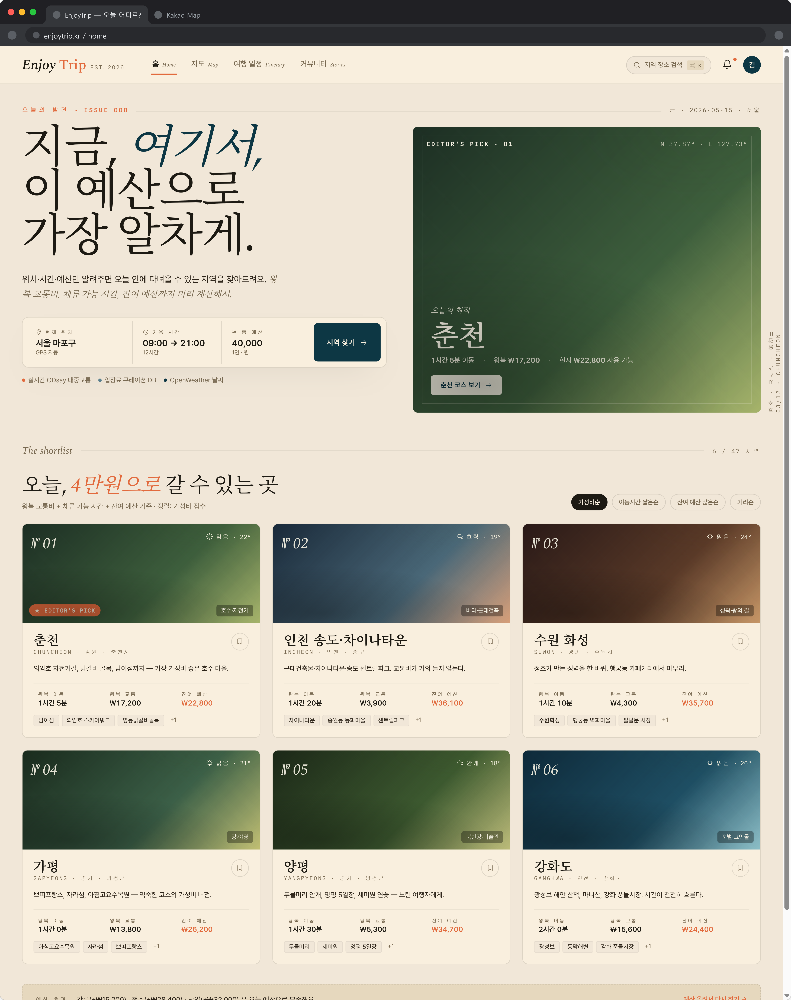
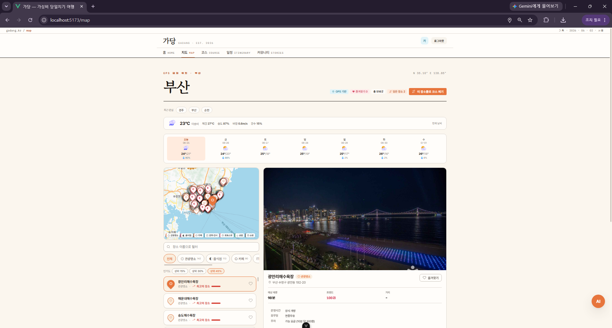
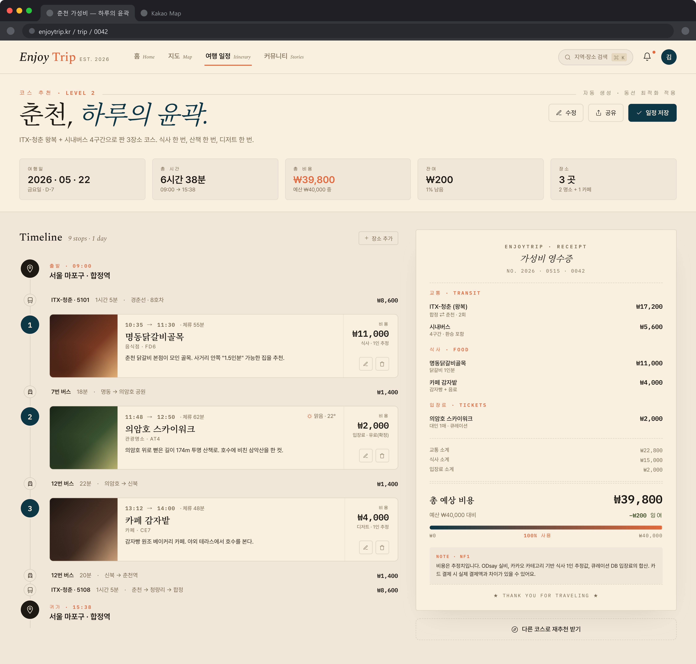

# 가당 (GaDang) — 가성비 당일치기 여행 플래너

> "지금 여기서, 오늘 하루 안에 어디를 가장 알차게 다녀올 수 있을까?"
>
> 현재 위치·가용 시간을 입력하면 **대중교통으로 당일치기 가능한 지역**을 역산해 추천하고,
> 트렌드·인기 기반으로 장소를 골라 **하루 코스를 자동 생성**하는 서비스.

팀 프로젝트 (SSAFY, 2026.05 ~ 2026.06) · 이후 개인 고도화 진행 중

| 홈 — 지역 추천 | 지도 — 장소 탐색 | 코스 — 자동 생성 |
|---|---|---|
|  |  |  |

---

## 아키텍처

```
[ Vue 3 + Vite ]
      │ REST (JWT)
      ▼
[ Spring Boot ]──────────────────────────────┐
  ├ 지역 추천: 출발지 기준 직통 교통 역산      │
  ├ 장소 스코어링: Kakao 후보 × Naver 인기     │
  ├ 코스 생성: Top-K + Greedy 동선 최적화      │
  └ AI 컨시어지: Spring AI Tool Calling ───► [ FastAPI RAG 서버 ]
      │                                        (OpenAI 임베딩 · 코사인 유사도 검색)
      ├── L1 캐시: Caffeine (인스턴스 로컬, sync)
      ├── L2 캐시: Redis    (공유, TTL 7d)
      ▼
[ MySQL 8 ]        [ 외부 API 5종: Kakao Local · ODsay 교통 · Naver DataLab/Blog · TourAPI · Korail ]
```

**기술 스택**: Java 17, Spring Boot, Spring Security(JWT·OAuth2), MyBatis, MySQL 8,
Caffeine + Redis, Spring AI(Tool Calling), FastAPI + NumPy(RAG), Vue 3, Docker Compose

---

## 핵심 엔지니어링

### 1. 외부 API 의존 조회 — 2계층 캐시로 22.4s → 0.07s

장소 추천 1회 = Kakao 최대 22개 구역 검색 + Naver 블로그 수백 건 조회.
콜드 상태에서 22.4초가 걸리는 조회를 캐시 계층화로 해결.

| 상태 | 응답 시간 | 경로 |
|---|---|---|
| 콜드 (캐시 없음) | **22.4 s** | 외부 API 실호출 |
| 재조회 | **0.07 s** | L1 Caffeine 적중 |
| **서버 재시작 직후** | **0.68 s** | L1 소멸 → **L2 Redis 적중** (200 places) |

- **좌표 격자 양자화 캐시 키**: 연속 좌표를 0.05°(≈5km) 격자로 반올림 →
  인접 좌표 요청이 같은 키를 공유해 적중률 확보. GPS·지도·지역명 진입을
  지역 표준 중심좌표로 스냅해 **어느 경로로 들어와도 동일 캐시·동일 결과**.
- **Cache stampede 방어**: 콜드 상태 동시 요청 N개가 전부 외부 API로 흘러가는
  문제를 진단, `@Cacheable(sync=true)`로 동일 키 단일 계산 보장.
  수평 확장 시 분산 락 필요성까지 문서화.

### 2. 외부 API 쿼터 방어 — 배치 예산 + 부정 캐싱

- 교통 API(ODsay)는 **일 1,000건 쿼터**. 요청 시 write-through로 자연 축적하고,
  새벽 4시 배치가 **쿼터의 8%만 예산으로 카운트다운**하며 미등록·오래된 노선을 선워밍.
- 미운행 노선은 `-1` **부정 캐싱**으로 반복 조회 차단.
- Naver 호출은 rate limit(429)에 맞춰 **동시 3개 제한 병렬 풀** + 지연으로 제어.

### 3. 인기 스코어링 — 쿼터가 다른 두 API의 역할 분리

- **장소 인기**: Naver 블로그 언급량(25,000/일) — "경주 황리단길" 85만 건은 통과,
  동음이의 노이즈는 1만 건 컷. 카테고리 가중치로 음식점 편중 보정.
- **지역 트렌드**: Naver DataLab 검색량(1,000/일, 상대값) — 모든 배치에 앵커(서울)를
  끼워 배치 간 스케일 통일, 24h DB 캐시로 귀한 쿼터 절약.

### 4. 코스 자동 생성 — 제약 조건 하의 동선 최적화

고정 장소(anchor)의 시간창을 하드 제약으로 하루를 구간 분할,
각 구간을 `인기점수 − 현재거리×0.7 − 목적지방향×0.3` 점수의 greedy로 채움.
식사·카페는 시간창 슬롯으로 삽입, 매 선택마다 귀가 시간 예산 검사.

---

## 트러블슈팅 기록

| 문제 | 진단 | 해결 | 기록 |
|---|---|---|---|
| 같은 지역인데 GPS/지역명 결과 불일치 | 캐시 키가 진입 경로마다 분리 | 좌표→지역 표준 중심 스냅으로 키 통일 | [devlog](devlog/2026-07-01.md) |
| 콜드 동시 요청 시 외부 호출 폭증 위험 | cache stampede (sync 부재) | `@Cacheable(sync=true)` | [devlog](devlog/2026-07-01.md) |
| 인메모리 캐시가 재시작·확장에 취약 | L1 인스턴스 로컬 한계 | L2를 DB 테이블 → Redis 이관, TTL을 EXPIRE에 위임 | [devlog](devlog/2026-07-07.md) |

> 개발 과정 전체는 [devlog/](devlog/) 참고 (삽질 포함 기록)

---

## 실행

```bash
# 루트 .env 작성 (.env.example 참고 — API 키)
docker compose up -d --build
# backend :8080 / frontend는 frontend/에서 pnpm install && pnpm dev (:5173)
```

MySQL·Redis·백엔드·AI서버 4개 컨테이너가 기동되며 스키마는 자동 생성됩니다.

## 문서

- [기획서 (전체 화면·시나리오)](docs/기획서.md)
- [알고리즘 설계](docs/알고리즘_설계.md)
- [발표자료 (pptx)](docs/가당_발표자료.pptx) · [산출물 문서 (docx)](docs/가당_프로젝트_산출물.docx)
