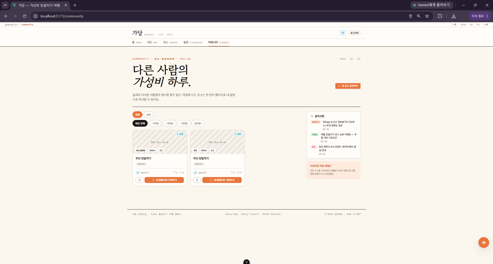
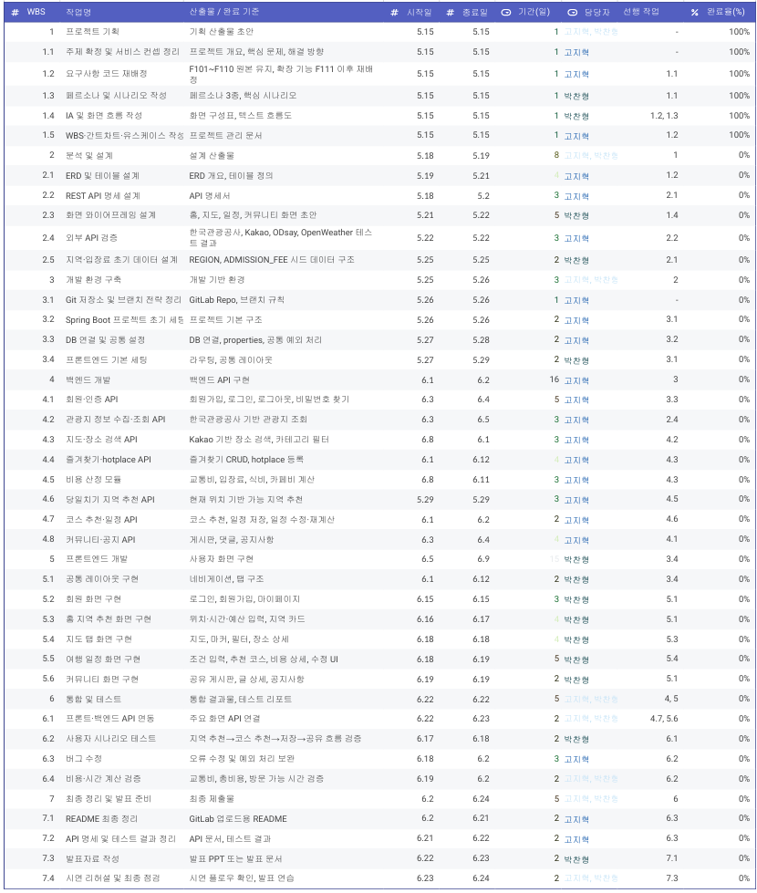
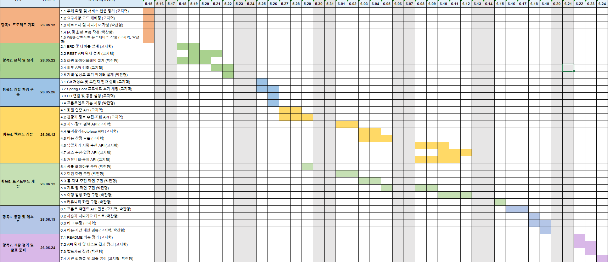

# 가당 — 가성비 당일치기 여행 서비스 기획서

> Spring Framework + REST API 기반 지역 관광 정보 조회 및 여행 계획 관리 프로젝트  
> 컨셉: **”지금 여기서, 오늘 하루 안에 어디를 가장 알차게 다녀올 수 있을까?”**  
> 작성 기준일: 2026-05-15  
> 프로젝트 기간: **2026-05-18 ~ 2026-06-24**  
> 참고: 본 문서는 **Mermaid 없이 표와 텍스트 다이어그램**으로 작성한다.

---

## 1. 프로젝트 개요

| 항목        | 내용                                                                                                                        |
| ----------- | --------------------------------------------------------------------------------------------------------------------------- |
| 프로젝트 명 | 가당 — 가성비 당일치기 여행 플래너                                                                                          |
| 한 줄 소개  | 현재 위치·가용 시간·활동 조건을 입력하면 당일치기로 다녀올 수 있는 지역과 하루 코스를 추천하는 서비스                       |
| 핵심 질문   | “지금 여기서, 오늘 하루 안에 어디를 가장 알차게 다녀올 수 있을까?”                                                          |
| 핵심 대상   | 여행 계획이 막막한 대학생·사회초년생, 주말 하루만 시간이 있는 직장인, 타지역 첫 방문자                                      |
| 핵심 차별점 | 현재 위치 기준 당일치기 가능 지역 추천, 프랜차이즈 제외 로컬 장소 추천, 교통비·입장료·식비 분리 표시, 시간 기반 코스 자동 추천 |
| 주요 데이터 | Kakao Map/Local API, ODsay 대중교통 API, 네이버 DataLab API, 지역 마스터 DB, 입장료 큐레이션 DB |
| 개발 기간   | 2026-05-18 ~ 2026-06-24                                                                                                     |

---

## 2. 서비스 컨셉

### 2.1 핵심 문제

가성비 당일치기 여행을 하려는 사용자는 보통 다음 문제를 겪는다.

| 문제                              | 설명                                                                  |
| --------------------------------- | --------------------------------------------------------------------- |
| 어디까지 당일치기로 가능한지 모름 | 현재 위치 기준으로 어느 지역까지 다녀올 수 있는지 판단하기 어렵다.    |
| 총비용 예측이 어려움              | 교통비, 식비, 입장료, 카페비가 따로 계산되어 실제 비용을 알기 어렵다. |
| 이동 시간이 낭비됨                | 장소는 좋아도 동선이 비효율적이면 하루 안에 다녀오기 어렵다.          |
| 계획 수정이 번거로움              | 장소 하나를 빼거나 추가하면 시간과 비용을 다시 계산해야 한다.         |

### 2.2 해결 방향

| 해결 방향                | 내용                                                                                                    |
| ------------------------ | ------------------------------------------------------------------------------------------------------- |
| 현재 위치 기반 지역 추천 | 사용자의 현재 위치, 출발 가능 시간, 귀가 마감 시간을 기준으로 당일치기 가능 지역을 먼저 추천한다.       |
| 2단계 추천 구조          | 1단계: 갈 수 있는 지역 추천 → 2단계: 선택 지역 안에서 코스 추천                                         |
| 총 예상 비용 표시        | 교통비·입장료(확정값)와 식비·카페비(추정값)를 분리하여 표시한다.                                         |
| 일정 수정 후 재계산      | 장소 추가, 삭제, 순서 변경 시 동선·시간·비용을 다시 계산한다.                                           |
| 공유 코스 활용           | 다른 사용자가 만든 가성비 코스를 가져와 내 일정으로 수정할 수 있다.                                     |

---

## 3. 서비스 흐름 및 IA

### 3.1 핵심 사용자 흐름

```text
[홈]
현재 위치 (GPS or 직접 입력) / 출발 시간 / 귀가 시간 입력
        ↓
당일치기 가능 지역 추천 (트렌드 점수 반영)
        ↓
지역 선택 → 또는 바로 코스 추천으로 진입
        ↓
[코스 조건 입력]
이동 허용 범위 / 활동 유형 / 카페 / 식사 / 트렌드 / 소프트 가이드
        ↓
[여행 일정 탭]
Top-K + Greedy 동선 최적화 코스 자동 추천
        ↓
타임라인 / 교통비·입장료(확정) / 식비(추정) 확인
        ↓
장소 교체·추가·삭제·순서 변경 후 재계산
        ↓
일정 저장
        ↓
[커뮤니티 탭]
코스 공유 또는 다른 코스 가져오기
```

### 3.2 화면별 구성 및 주요 기능

#### 홈 / 지역 추천


| 주요 영역          | 기능                                                                          |
| ------------------ | ----------------------------------------------------------------------------- |
| 검색 및 내비게이션 | 홈, 지도, 여행 일정, 커뮤니티로 이동하고 지역·장소를 검색한다.                |
| 추천 조건 입력     | 현재 위치, 출발 시간, 귀가 시간을 기준으로 당일치기 가능 지역을 조회한다.    |
| 추천 지역 카드     | 왕복 이동시간, 교통비, 체류 가능 시간, 대표 장소를 함께 보여준다.             |
| 정렬·필터          | 트렌드순, 이동시간 짧은순, 거리순으로 후보 지역을 비교한다.                   |

#### 지도 / 장소 탐색


| 주요 영역          | 기능                                                                        |
| ------------------ | --------------------------------------------------------------------------- |
| 지역 요약          | 선택 지역, 체류 가능 시간, 즐겨찾기 수를 표시한다.                          |
| 장소 검색·카테고리 | 지역 내 관광명소, 음식점, 카페, 문화시설을 검색하고 필터링한다.             |
| 지도 마커          | 검색 결과와 선택 장소를 지도 위에 마커로 표시한다.                          |
| 장소 상세 패널     | 주소, 예상 비용, 이전 장소 기준 이동 정보를 확인한다. 운영시간은 카카오맵 링크로 제공한다. |
| 즐겨찾기           | 마음에 드는 장소를 저장하고 여행 일정 생성에 재사용한다.                    |

#### 여행 일정 / 코스 추천


| 주요 영역        | 기능                                                                 |
| ---------------- | -------------------------------------------------------------------- |
| 일정 요약        | 여행일, 총 시간, 방문 장소 수를 한눈에 보여준다.                                         |
| 자동 생성·최적화 | 활동 조건·이동 허용 범위·트렌드를 고려해 Top-K + Greedy 동선 최적화로 하루 코스를 추천한다. |
| 타임라인         | 출발지, 교통 구간, 장소 방문 순서, 체류 시간을 시간순으로 표시한다.                        |
| 비용 영수증      | 교통비·입장료(확정값)와 식비·카페비(추정값)를 분리 표시한다. 소프트 가이드 초과 시 알림.    |
| 일정 관리        | 장소 교체·추가·삭제·순서 변경, 식비 등급 조정, 재추천을 지원한다.                          |

#### 커뮤니티 / 코스 공유



| 주요 영역      | 기능                                                                  |
| -------------- | --------------------------------------------------------------------- |
| 지역·예산 필터 | 지역과 예산 범위로 다른 사용자의 공유 코스를 탐색한다.                |
| 대표 코스 카드 | 인기 코스의 총비용, 총 시간, 장소 수, 좋아요·댓글·저장 수를 표시한다. |
| 코스 가져오기  | 마음에 드는 공유 코스를 내 일정으로 복사해 수정할 수 있다.            |
| 공지사항       | API 개선, 이벤트 등 서비스 운영 공지를 확인한다.                      |

#### 마이페이지


| 주요 영역    | 기능                                                         |
| ------------ | ------------------------------------------------------------ |
| 프로필 요약  | 닉네임, 이메일, 지역, 가입일, 프로필 수정 기능을 제공한다.   |
| 이용 통계    | 여행 횟수, 총 사용 비용, 절약 금액, 공유 코스 수를 요약한다. |
| 내 여행 일정 | 저장한 여행 일정의 날짜, 지역, 비용, 상태를 확인한다.        |
| 즐겨찾기     | 저장한 장소를 모아보고 일정 생성에 활용한다.                 |
| 작성 게시글  | 내가 공유한 코스와 커뮤니티 활동을 관리한다.                 |

#### 관리자 대시보드


| 주요 영역          | 기능                                                         |
| ------------------ | ------------------------------------------------------------ |
| 운영 지표          | 신규 가입, 일정 생성, 코스 공유, API 호출 현황을 확인한다.   |
| 주간 활동 차트     | 최근 14일간 일정 생성과 지역 추천 사용량을 비교한다.         |
| 외부 API 상태      | Kakao, ODsay, 네이버 DataLab 응답 속도와 성공률을 모니터링한다. |
| 회원 관리          | 최근 가입 회원과 계정 상태를 확인하고 관리한다.              |
| 지역·입장료 데이터 | 지역 마스터와 입장료 큐레이션 데이터를 운영자가 갱신한다.    |

---

## 4. 페르소나 및 핵심 시나리오

### 4.1 페르소나

| 페르소나 | 프로필                                             | 니즈                               | 핵심 기능                                            |
| -------- | -------------------------------------------------- | ---------------------------------- | ---------------------------------------------------- |
| 김절약   | 24세 대학생. 돈은 부족하지만 주말에 놀러 가고 싶음 | 실제 비용 파악 후 하루 알차게 다녀오기 | 당일치기 지역 추천, 코스 자동 추천, 비용 분리 표시 |
| 이주말   | 29세 직장인. 주말 하루만 시간이 있음               | 이동 시간이 짧고 실패 없는 일정    | 이동시간 기반 지역 추천, 시간 기반 방문 가능 판단    |
| 박첫방문 | 32세 타지역 거주자. 특정 도시 첫 방문              | 검증된 코스를 참고하고 싶음        | 공유 게시판, 공유 코스 가져오기                      |

### 4.2 입력 시나리오

#### 시나리오 A. 완전 즉흥 — 아무것도 모르겠고 그냥 추천해줘

```
출발지:         현재 위치 (GPS)
출발 시간:      14:00
귀가 시간:      20:00
이동 허용 범위: 중 (기본값)
소프트 가이드:  설정 안 함
고정 장소:      없음
활동 유형:      미선택 (전체)
카페:           OFF
식사:           점심 OFF / 저녁 OFF
트렌드:         OFF
```
→ 6시간 안에 갈 수 있는 관광명소·카페·공원 균형 배합 코스 자동 생성

---

#### 시나리오 B. 목적지 있고 저녁까지 즐기고 싶음

```
출발지:         현재 위치 (GPS)
출발 시간:      17:00
귀가 시간:      22:00
이동 허용 범위: 하
소프트 가이드:  30,000원
고정 장소:      역삼 멀티캠퍼스 / 17:00
활동 유형:      공원·산책, 포토스팟
카페:           ON / 루프탑
식사:           저녁 ON / 일식 / 일반
트렌드:         ON
```
→ 17:00 멀티캠퍼스 anchor → 트렌드 루프탑 카페 → 포토스팟 → 라멘집 코스 생성
→ 예상 비용 32,000원 → 소프트 가이드 초과 알림 표시

---

#### 시나리오 C. 하루 종일 문화·전시 투어

```
출발지:         을지로3가역 (직접 입력)
출발 시간:      10:00
귀가 시간:      19:00
이동 허용 범위: 중
소프트 가이드:  50,000원
고정 장소:      없음
활동 유형:      문화시설·전시·공연
카페:           ON / 베이커리
식사:           점심 ON / 상관없음 / 일반
                저녁 ON / 한식 / 저가
트렌드:         OFF
```
→ 전시관 → 베이커리 카페 → 미술관 → 점심 → 공연장 → 저녁 코스 생성

---

#### 시나리오 D. 부산 당일치기 원정

```
출발지:         서울역 (직접 입력)
출발 시간:      07:00
귀가 시간:      22:00
이동 허용 범위: 상
소프트 가이드:  100,000원
고정 장소:      없음
활동 유형:      관광명소, 공원·산책, 포토스팟
카페:           ON / 일반
식사:           점심 ON / 해산물 / 일반
                저녁 ON / 지역 특색 / 일반
트렌드:         ON
```
→ 지역 추천 → 부산 선택 (KTX 왕복 포함)
→ 광안리·해동용궁사 → 카페 → 해산물 점심 → 감천문화마을 → 돼지국밥 저녁 코스 생성

---

#### 시나리오 E. 예산 극도로 타이트, 무료 위주

```
출발지:         현재 위치 (GPS)
출발 시간:      13:00
귀가 시간:      18:00
이동 허용 범위: 하
소프트 가이드:  5,000원
고정 장소:      없음
활동 유형:      공원·산책
카페:           OFF
식사:           전체 OFF
트렌드:         OFF
```
→ 무료 공원·산책로·뷰포인트 위주 코스 생성
→ 교통비만 발생, 예상 비용 3,200원

---

#### 시나리오 F. 고정 장소 여러 개 + 사이사이 채우기

```
출발지:         홍대입구역 (직접 입력)
출발 시간:      11:00
귀가 시간:      20:00
이동 허용 범위: 하
소프트 가이드:  설정 안 함
고정 장소:      홍대 앞 공원 / 11:30
                연남동 경의선숲길 / 14:00
                망원시장 / 16:00
활동 유형:      포토스팟, 쇼핑
카페:           ON / 테마·이색
식사:           점심 ON / 분식 / 저가
트렌드:         ON
```
→ 3개 anchor 기반으로 사이사이 테마 카페·포토스팟 자동 배치
→ 홍대 공원 → 분식 점심 → 이색 카페 → 경의선숲길 → 포토스팟 → 망원시장 코스 생성

---

## 5. 사용 데이터 및 외부 API

| 데이터 / API                     | 용도                                                                | 사용 위치          |
| -------------------------------- | ------------------------------------------------------------------- | ------------------ |
| Kakao Map JavaScript API         | 지도 표시, 마커 표시, 지도 기반 장소 시각화                         | 지도 탭, 일정 상세 |
| Kakao Local API                  | 장소 검색, 카테고리 기반 관광지·음식점·카페·문화시설·공연·쇼핑 검색 | F114, F115, F117   |
| ODsay API                        | 대중교통 경로, 소요시간, 요금 조회                                  | F111, F123, F125   |
| 네이버 DataLab API               | 검색 트렌드 기반 인기 지역·장소 파악 및 추천 점수 반영              | F139               |
| 지역 마스터 DB                   | 당일치기 가능 지역 후보 저장                                        | F111, F112         |
| 입장료 큐레이션 DB               | 장소별 입장료 저장 및 비용 계산                                     | F124, F136         |

### 5.1 데이터 수집 정책 준수

본 프로젝트의 데이터 수집은 아래 법적·윤리적 절차를 준수한다.

| 수집 방법        | 준수 사항                                                                                     |
| ---------------- | --------------------------------------------------------------------------------------------- |
| 웹 크롤링        | 수집 대상 사이트의 `/robots.txt`를 반드시 확인하고, `Disallow` 경로는 수집하지 않는다.        |
| 외부 API         | 각 API의 이용약관 및 호출 한도를 준수하고, API Key는 서버 환경변수에만 보관한다.              |
| 크롤링 대상 선정 | 크롤링 허용이 확인된 매체만 대상으로 하며, 수집 내역을 문서화한다.                           |

### 5.2 데이터 처리 방식

| 항목                      | 처리 방식                                                              |
| ------------------------- | ---------------------------------------------------------------------- |
| 지도·좌표·마커            | Kakao Map API를 사용한다.                                              |
| 장소 검색·조회            | Kakao Local API의 카테고리 검색을 메인으로 사용한다.                   |
| 당일치기 가능 지역 판단   | 현재 위치와 지역 중심 좌표를 기준으로 왕복 이동시간·교통비를 계산한다. |
| 입장료                    | 큐레이션 DB에 있으면 확정값, 없으면 카테고리별 추정값을 사용한다.      |
| 식비                      | Kakao Local API의 가격대 메타데이터를 우선 활용하고, 없으면 카테고리·지역별 평균 추정값을 사용한다. 모든 식비는 추정값임을 UI에 표시한다. |
| 총 예상 비용              | 교통비 + 입장료 + 식비 + 카페비를 합산한다.                            |
| 비용 신뢰도               | 무료 / 확정 / 추정 상태를 함께 표시한다.                               |
| 실시간 인기 지역·장소     | 네이버 DataLab 검색 트렌드를 배치로 수집하여 지역·장소별 점수를 DB에 저장하고 추천 가중치에 반영한다. |

---

## 6. 단계별 개발 계획

### 6.0 개발 단계 개요

| 단계 | 목표 | 완료 기준 |
| ---- | ---- | --------- |
| **Phase 1 — MVP** | 입력 넣으면 코스가 나온다 | 출발지·시간 입력 → 타임라인·비용 출력 end-to-end 동작 |
| **Phase 2 — 알고리즘 + 성능** | 추천 품질 향상 + 백엔드 성능 어필 | 트렌드·프랜차이즈 필터·캐싱·병렬 호출 동작 + 응답속도 측정 수치 확보 |
| **Phase 3 — 심화** | 차별화 기능 추가 | 여러 코스 제시·대체 장소·공유 코스 가져오기 동작 |

---

## 7. 요구사항 명세

### 7.1 Phase 1 — MVP
> 목표: 출발지·시간 입력 → 코스 타임라인·비용 출력 end-to-end 동작

| ID   | 분류 | 요구사항명               | 상세                                                                                          |
| ---- | ---- | ------------------------ | --------------------------------------------------------------------------------------------- |
| F107 | 회원 | 회원 관리                | 회원가입, 수정, 조회, 탈퇴                                                                    |
| F108 | 회원 | 로그인 관리              | 로그인 / 로그아웃 / 비밀번호 찾기 (JWT)                                                       |
| F101 | 여행 | 장소 정보 조회           | Kakao Local API로 관광지·음식점·카페·문화시설 카테고리별 조회                                 |
| F114 | 지도 | 지역 내 장소 검색        | Kakao Local API 키워드 기반 장소 검색                                                         |
| F115 | 지도 | 콘텐츠 유형별 필터       | 관광명소·음식점·카페·문화시설·공연·쇼핑 카테고리 필터                                         |
| F116 | 지도 | 지도 마커 표시           | 검색 결과·선택 경로를 Kakao Map에 마커로 표시                                                 |
| F117 | 지도 | 장소 상세 정보           | 주소·카테고리·이미지·좌표·예상 비용·입장료 조회. 운영시간은 카카오맵 링크로 제공              |
| F118 | 지도 | 즐겨찾기                 | 관심 장소 즐겨찾기 추가·삭제·목록 조회. 일정 생성 시 재사용                                  |
| F120 | 일정 | 코스 조건 입력 (기본)    | 출발지 (GPS or 직접 입력) / 출발·귀가 시간 / 활동 유형 / 식사 끼니별 ON/OFF·음식 종류·식비 등급 |
| F122 | 일정 | 시간 기반 방문 가능 판단 | 이동시간 + 카테고리별 기본 체류시간 누적으로 귀가 시간 초과 장소 제거                         |
| F123 | 일정 | 대중교통 경로·요금 조회  | ODsay 도시 내 경로·소요시간·요금. 미지원 도시 시 거리 기반 추정 fallback                      |
| F124 | 일정 | 총 예상 비용 계산        | 교통비·입장료(확정) + 식비·카페비(추정) 분리 표시                                             |
| F125 | 일정 | 코스 자동 추천 (기본)    | 거리 기반 정렬로 후보 선정 → Greedy 동선 최적화 → 타임라인 생성. 재추천 가능                  |
| F126 | 일정 | 여행 일정 저장           | 코스를 여행 일정으로 저장                                                                     |
| F109 | 회원 | 공지사항                 | 공지사항 등록, 수정, 삭제, 조회                                                               |
| F110 | 여행 | 여행 코스 공유 게시판    | 코스 공유, 등록·수정·삭제·조회. 타임라인·총비용 자동 첨부. 댓글 작성·삭제                    |
| F133 | 회원 | 마이페이지               | 내 여행 일정·즐겨찾기·작성 게시글 모아보기                                                   |
| NF-DB | 성능 | DB 인덱스 설계           | PLACE(category_code·lat·lng), PLACE_TREND(place_id·trend_score), REGION_TREND(region_id) 인덱스 적용 |

---

### 7.2 Phase 2 — 알고리즘 + 성능 최적화
> 목표: 추천 품질 향상 + 백엔드 성능 어필 포인트 확보

| ID   | 분류 | 요구사항명                  | 상세                                                                                                    |
| ---- | ---- | --------------------------- | ------------------------------------------------------------------------------------------------------- |
| F120 | 일정 | 코스 조건 입력 (확장)       | Phase 1에 이동 허용 범위 (상·중·하) / 고정 장소·방문 시간 (최대 3개) / 카페 종류 / 트렌드 ON/OFF 추가  |
| F121 | 일정 | 비용 초과 알림              | 소프트 예산 가이드 설정 시 초과 알림. 극소 예산 시 무료·저가 장소 우선 구성                             |
| F125 | 일정 | 코스 자동 추천 (고도화)     | Top-K 스코어링 (트렌드·거리 가중치) + 프랜차이즈 필터 + 이동 허용 범위 반경 적용 + 여유 시간 장소 추가 |
| F127 | 일정 | 일정 수정 및 재계산         | 장소 추가·삭제·순서 변경, 식비 등급 조정 시 동선·비용 즉시 재계산                                       |
| F111 | 여행 | 당일치기 가능 지역 추천     | ODsay 도시간 검색으로 왕복 교통비·시간 계산. 트렌드 점수 반영. 소프트 가이드 초과 지역 하단 배치        |
| F112 | 여행 | 지역별 당일치기 정보 표시   | 왕복 교통비·이동시간·체류 가능 시간·대표 관광지 미리보기 표시                                           |
| F113 | 여행 | 지역 선택·탭 연동           | 지역 선택 시 해당 지역 장소 탐색으로 이동                                                               |
| F139 | 여행 | 트렌드 기반 지역·장소 추천  | DataLab `@Scheduled` 배치 수집 → REGION_TREND·PLACE_TREND DB 저장 → 추천 가중치 반영                   |
| NF-C | 성능 | Kakao API 결과 캐싱       | 지역+카테고리+반경 키 기준 Spring `@Cacheable` 적용. TTL 1시간. 캐시 적중 시 응답속도 측정 수치 확보    |
| NF-P | 성능 | 코스 추천 병렬 API 호출   | 카테고리별 Kakao 호출 + ODsay 구간별 호출을 `CompletableFuture`로 병렬 실행. 직렬 대비 응답시간 비교 측정 |
| F134 | 관리자 | 회원 관리                 | 회원 목록 조회, 강제 탈퇴                                                                               |
| F135 | 관리자 | 공지사항 관리             | 공지 등록·수정·삭제                                                                                     |
| F136 | 관리자 | 운영 데이터 관리          | 지역 마스터, 입장료 큐레이션, 프랜차이즈 블랙리스트 등록·수정                                           |

---

### 7.3 Phase 3 — 심화
> 목표: 차별화 극대화. 시간 여유 있을 때 진행

| ID   | 분류     | 요구사항명            | 상세                                                                                             |
| ---- | -------- | --------------------- | ------------------------------------------------------------------------------------------------ |
| F125 | 일정     | 코스 3종 제시         | 동일 조건으로 "트렌드 중심 / 동선 효율 / 균형" 3가지 코스 동시 생성 후 선택                     |
| F128 | 일정     | 대체 장소 추천        | 특정 장소 제외 시 Top-K 후순위에서 비슷한 가격대·근처 장소 재추천                               |
| F132 | 커뮤니티 | 공유 코스 가져오기    | 다른 사용자 코스를 내 일정으로 복사 후 내 출발지·시간 기준으로 교통 경로·비용 재계산            |

---

### 7.4 추가·고도화 기능 요약

| 분류 | 추가 기능 | 상세 |
| ---- | --------- | ---- |
| UI | 전역 플로팅 AI 챗봇 위젯 | 모든 화면에서 열 수 있는 FAB/패널형 챗봇. 지역·장소·코스 액션 버튼으로 지도와 코스 화면 이동 지원 |
| UI | 지도/일정 탭 개선 | 지도 추천 결과를 SSE로 부분 표시하고, 코스 추천 결과를 일정 타임라인 컴포넌트로 즉시 확인 |
| AI | Spring AI 컨시어지 | `POST /api/ai/chat`으로 자연어 요청을 받아 지역 추천, 장소 추천, 코스 생성, 공유 코스 검색 Tool 호출 |
| AI | 추천 Tool 연동 | `recommendRegions`, `recommendPlaces`, `generateCourse`, `searchSharedCourses` 4개 Tool 구성 |
| RAG | FastAPI RAG 서버 | 코스 후기 코퍼스 32건을 임베딩하고 `/search`에서 코사인 유사도 기반 공유 코스 검색 제공 |
| 추천 | 다중 허브 지역 발견 | 출발지 반경 내 최대 3개 역·터미널을 병렬 탐색해 부산역·부전역처럼 복수 허브를 반영 |
| 교통 | ODsay 버스 탐색 복구 | ODsay 인증/IP 문제와 부정 캐시를 정리하고 버스·철도 추천 옵션을 확대 |
| 장소 | 스코어링·캐시 고도화 | 지역명/좌표 검색 경로를 통합하고 L1 Caffeine + L2 DB 캐시, 서브지역·그리드 보강, 상위 15/30/45% 필터 적용 |
| 장소 | 지도 마커 품질 개선 | 후보를 구역별로 스트리밍 표시하고 로드뷰 폴백, 프랜차이즈·주차장·실내 유흥성 장소 필터 강화 |
| 일정 | 코스 스냅샷 저장 | 생성된 `CourseResponse`를 `TRIP_PLAN.course_json`에 저장해 추천 당시의 실제 일정 결과 보존 |

---

## 9. 비기능적 요구사항

| ID  | 분류       | 요구사항명         | 상세                                                                                      |
| --- | ---------- | ------------------ | ----------------------------------------------------------------------------------------- |
| NF1 | 정확성     | 데이터 정확성      | 외부 API 데이터와 큐레이션 데이터의 출처를 구분하고, 비용·이동시간은 추정치임을 표시한다. |
| NF2 | 사용성     | 쉬운 진입          | 출발지·시간 입력 후 조건 선택 없이 바로 코스 추천이 가능해야 한다 (자동 추천 경로 기준).  |
| NF3 | 성능       | 응답 속도          | 코스 추천 응답 3초 이내 목표. 병렬 API 호출·캐싱 적용 전후 응답시간 측정 및 비교 기록.   |
| NF4 | 보안       | 인증·인가          | 회원 전용 기능 접근 제어, 비밀번호 암호화, API Key 서버 보관을 적용한다.                  |
| NF5 | 확장성     | API Provider 분리  | 지도, 교통, 트렌드 API 연동 로직을 모듈화한다.                                            |
| NF6 | 유지보수성 | 계층형 구조        | Controller, Service, DAO/Repository 계층을 분리한다.                                      |
| NF7 | 호환성     | GitLab README 호환 | Mermaid를 사용하지 않고 표와 텍스트 기반 다이어그램을 사용한다.                           |

---

## 8. 추천 로직

### 8.1 지역 추천 (Phase 2 — 구현 완료, 교통 기반 동적 발견)

> 고정 지역 목록을 거르는 방식이 아니라, 출발지 근처 역·터미널에서
> **"오늘 직통으로 갈 수 있는 모든 곳"을 역으로 수집**해 지역 후보를 만든다.

| 단계 | 처리 내용 | 데이터 소스 |
| ---- | --------- | ---------- |
| 1 | 현재 위치(GPS/입력), 출발·귀가 시간 입력 | — |
| 2 | 출발지에서 가장 가까운 기차역·버스터미널 선정 | 좌표 거리 계산 |
| 3 | 버스: 출발 터미널의 직통 도착지 전체 → 도착지별 시간·요금·편수 병렬 조회 | Odsay `destinationTerminals` + `searchInterBusSchedule` |
| 4 | 기차: 출발역 ↔ 전국 주요역 당일 실편성 조회 (KTX·무궁화·ITX별 편수·최저요금·최단시간) | TAGO 열차정보 |
| 5 | 도착 역·터미널 좌표 → 행정구역(시·군) 자동 판정 후 지역 단위로 병합 | Kakao coord2address |
| 6 | 왕복 이동시간 반영 체류 가능 시간 계산, 90분 미만 지역 제외 | — |
| 7 | 트렌드 점수 부여 (여행 의도 키워드, 앵커 정규화로 배치 간 스케일 통일) | 네이버 DataLab |
| 8 | 추천 점수 = normTrend^1.0 × stayRatio^2.5 — 정렬 후 카드 표시 | 프론트 계산 |

> 추천 점수 모델·DataLab 정규화 상세는 **[devlog/2026-06-25.md](devlog/2026-06-25.md)** 참고.

---

### 8.2 코스 추천 알고리즘 (박찬형 담당 — Phase 1→2→3 순차 고도화)

> 알고리즘은 Phase별로 **같은 구조 위에 기능을 쌓는 방식**으로 진화한다.
> 각 Phase는 이전 Phase의 코드를 대체하지 않고 확장한다.

---

#### 8.2.1 공통 처리 흐름 (Phase 전체 동일)

```text
입력 파싱
  → 후보 수집 (Kakao Local API)
  → 후보 필터링 및 정렬
  → 동선 최적화 (Greedy)
  → 식사·카페 슬롯 삽입
  → 교통 경로 조회 (ODsay)
  → 시간 제약 검사
  → 타임라인 생성
  → 비용 계산
  → 결과 출력
```

---

#### 8.2.2 단계별 구현 범위

| 구현 항목 | Phase 1 | Phase 2 | Phase 3 |
| --------- | ------- | ------- | ------- |
| **입력** | 출발지·시간·활동 유형·식사 기본 | + 이동 범위(상·중·하) / 고정 장소(최대 3개) / 트렌드 ON/OFF / 소프트 가이드 | 동일 |
| **검색 반경** | 5km 고정 | 이동 범위에 따라 동적 (5·15·50km). 결과 부족 시 자동 확장 | 동일 |
| **후보 필터** | 없음 | FRANCHISE_BLACKLIST 대조 → 프랜차이즈 제거 | 동일 |
| **후보 정렬** | 거리 오름차순 | 카테고리별 가중치 스코어링 (관광·문화: 트렌드60%+거리40% / 카페·식당: accuracy50%+거리50%) | 동일 |
| **Top-K 선정** | 카테고리별 거리 상위 3개 | 스코어 상위 K개. 트렌드 임계값 미달 제외 | 동일 |
| **동선 최적화** | Greedy nearest-neighbor (출발지 기준) | 고정 장소 anchor → 구간 분할 → 구간별 Greedy | 동일 |
| **교통 조회** | ODsay 도시 내 (버스·지하철). 미지원 시 거리 기반 추정 | + ODsay 도시간 (KTX·고속버스·항공) | 동일 |
| **API 처리** | 순차 호출 | `CompletableFuture` 병렬 호출 + `@Cacheable` 캐싱 | 동일 |
| **여유 시간** | 처리 없음 | 귀가까지 90분 이상 여유 시 Top-K 후순위 장소 자동 추가 | 동일 |
| **비용 알림** | 없음 | 소프트 가이드 초과 시 경고 표시 | 동일 |
| **출력** | 코스 1개 | 코스 1개 | **코스 3개** (가중치만 다르게 3회 실행) |

#### 8.2.3 Phase 3 — 코스 3종 제시 상세

```text
동일 후보 풀에서 가중치만 바꿔 3회 실행 (추가 API 호출 없음)

코스 A "요즘 뜨는 코스"  : 트렌드 70% + 거리 30%
코스 B "추천 코스"       : 트렌드 50% + 거리 50%  ← 기본 선택
코스 C "동선 효율 코스"  : 트렌드 30% + 거리 70%

→ 3개를 탭/카드로 동시 표시 → 선택 후 동일 수정 흐름
```

### 8.3 비용 산정 방식

```text
[출력 - 메인]
  예상 총비용: 교통비 + 입장료 + 식비 합산
  소프트 가이드 설정 시: 목표 금액 초과 여부 알림

[출력 - 상세보기]
  교통비:  ODsay 확정값
  입장료:  확정 or 추정값
  식비:    끼니별 등급 기반 추정값
  ─────────────────────────────
  각 항목 등급 조정 가능 → 즉시 비용 재계산
```

| 비용 항목 | 처리 방식 | 신뢰도 |
| --------- | --------- | ------ |
| 교통비 | ODsay API 응답 요금 | 확정 |
| 무료 장소 | 0원 | 확정 |
| 박물관·미술관 | 입장료 DB 우선, 없으면 3,000원 추정 | 확정/추정 |
| 전시관·체험관 | 입장료 DB 우선, 없으면 5,000원 추정 | 확정/추정 |
| 음식점 (저가) | 10,000원 추정 | 추정 |
| 음식점 (일반) | 15,000원 추정 | 추정 |
| 음식점 (고가) | 25,000원 추정 | 추정 |
| 카페 | 7,000원 추정 | 추정 |

> **비고:** 예산 포함 항목을 사용자가 직접 선택한다. 제외한 항목도 상세보기에서 참고용으로 표시하며, 실제 예상 합계를 함께 제공한다. 식비는 카카오 Local API 가격대 등급 기반 추정값이며 "추정값" 배지를 노출한다.

---

### 8.4 데이터 저장·캐시 전략 (요약)

> 원칙: **사용자 요청 경로에서 외부 API를 만나지 않는다.**

```
L1 Caffeine (메모리, TTL 1h) → L2 MySQL (영속) → L3 외부 API (쿼터 제한)
요청 시 위에서부터 조회, miss면 아래로 — 가져온 값은 위 계층에 역저장(write-through)
```

- 갱신은 사전 워밍 없이 **수요 기반**: 실제 조회된 노선만 저장, 새벽 배치가 묵은 행만 갱신 (Odsay 쿼터 보호)
- 결과: 재시작 후 첫 검색 **76초 → 3.6초**, 이후 **0.18초**

> 데이터별 저장소 선택 근거·TTL·측정 상세는 **[devlog/2026-06-25.md](devlog/2026-06-25.md)** 의 "데이터 저장·캐시 전략" 참고.

---

## 9. 데이터 모델 개요

### 9.1 주요 테이블

| 테이블         | 설명                            | 주요 컬럼                                                                                     |
| -------------- | ------------------------------- | --------------------------------------------------------------------------------------------- |
| USER           | 회원 정보                       | user_id, email, password, nickname, role                                                      |
| REGION         | 지역 추천 후보                  | region_id, sido, sigungu, name, center_lat, center_lng, content_count                         |
| PLACE          | 관광지·음식점·카페 등 장소 정보 | place_id, region_id, api_source, external_place_id, name, category_code, address, lat, lng    |
| ADMISSION_FEE  | 장소별 입장료                   | fee_id, place_id, fee, fee_type, source_type                                                  |
| FAVORITE       | 회원 즐겨찾기                   | favorite_id, user_id, place_id                                                                |
| TRIP_PLAN      | 여행 일정                       | trip_id, user_id, region_id, title, trip_date, start_point, end_point, budget_guide, total_cost |
| TRIP_ITEM      | 일정에 포함된 방문 장소         | item_id, trip_id, place_id, visit_order, arrival_time, stay_minutes, admission_fee, food_cost |
| TRIP_ROUTE     | 일정 내 장소 간 이동 정보       | route_id, trip_id, from_item_id, to_item_id, transport_type, duration_minutes, fare           |
| COMMUNITY_POST | 공유 게시글                     | post_id, user_id, trip_id, title, content                                                     |
| COMMENT        | 댓글                            | comment_id, post_id, user_id, content                                                         |
| NOTICE         | 공지사항                        | notice_id, admin_id, title, content                                                           |
| REGION_TREND       | 지역별 검색 트렌드 점수     | trend_id, region_id, trend_score, source, collected_at                                    |
| PLACE_TREND        | 장소별 검색 트렌드 점수     | trend_id, place_id, trend_score, source, collected_at                                     |
| FRANCHISE_BLACKLIST | 프랜차이즈 블랙리스트      | id, brand_name, registered_at                                                             |

### 9.2 관계 개요

```text
USER 1 ─ N FAVORITE N ─ 1 PLACE
USER 1 ─ N TRIP_PLAN
REGION 1 ─ N PLACE
REGION 1 ─ N TRIP_PLAN
PLACE 1 ─ N TRIP_ITEM
PLACE 1 ─ 0..1 ADMISSION_FEE
TRIP_PLAN 1 ─ N TRIP_ITEM
TRIP_PLAN 1 ─ N TRIP_ROUTE
TRIP_PLAN 1 ─ 0..1 COMMUNITY_POST
COMMUNITY_POST 1 ─ N COMMENT
REGION 1 ─ N REGION_TREND
PLACE  1 ─ N PLACE_TREND
```

---

## 10. 유스케이스

### 10.1 액터

| 액터        | 설명                                                             |
| ----------- | ---------------------------------------------------------------- |
| 비회원      | 지역 추천, 관광지 조회, 장소 상세 조회, 공유 게시판 조회 가능    |
| 회원        | 비회원 기능 + 즐겨찾기, 일정 저장, 코스 공유 가능                |
| 관리자      | 회원·공지·지역·입장료·프랜차이즈 데이터 관리 가능                |
| 외부 시스템 | Kakao API, ODsay API, 네이버 DataLab API                         |

### 10.2 유스케이스 목록

| 액터        | 유스케이스                                                                                                                              |
| ----------- | --------------------------------------------------------------------------------------------------------------------------------------- |
| 비회원      | 지역별 관광지 조회, 콘텐츠별 관광지 조회, 당일치기 가능 지역 추천, 장소 상세 조회, 공유 게시판 조회, 공지사항 조회                      |
| 회원        | 회원가입, 로그인, 로그아웃, 비밀번호 찾기, 회원정보 수정, 즐겨찾기 관리, 여행 일정 저장, 일정 수정, 코스 공유, 댓글 작성 |
| 관리자      | 회원 관리, 공지사항 관리, 지역 데이터 관리, 입장료 데이터 관리, 프랜차이즈 블랙리스트 관리                                |
| 외부 시스템 | 지도 정보 제공, 장소 검색 제공, 교통 경로 제공, 트렌드 데이터 제공                                                                      |

### 10.3 유스케이스 관계도


---

## 11. WBS

> 기간: 2026-05-18 ~ 2026-06-24

[WBS 스프레드시트](https://docs.google.com/spreadsheets/d/1NSG9rD-zeLj9xBqoHYE4Eoco1eRPM3QF-cvVyRrJEMM/edit?usp=sharing)



---

## 12. 간트차트



---

## 13. 기술 스택

| 영역        | 기술                                                                  |
| ----------- | --------------------------------------------------------------------- |
| Backend     | Java 17, Spring Boot 4.0.6, Spring MVC, Spring Security, MyBatis     |
| AI Backend  | Spring AI 2.0.0, OpenAI API, Tool Calling                  |
| RAG Server  | FastAPI, Uvicorn, NumPy, `text-embedding-3-small`                    |
| Database    | MySQL 8 (`gadang` DB, user: `gadang`, port: 3306)                     |
| 캐시        | Caffeine (`@Cacheable`, TTL 1시간, 최대 500 항목)                     |
| Frontend    | Vue 3.5 + Vite 8 + pnpm (포트 5175)                                  |
| 지도        | Kakao Map JavaScript API                                              |
| 장소 검색   | Kakao Local API                                                       |
| 교통        | ODsay API (도시간 버스·KTX 운행정보)                                  |
| 관광 이미지 | 한국관광공사 TourAPI v4                                               |
| 트렌드      | 네이버 DataLab API                                                    |
| 협업        | GitLab, Notion, Figma                                           |
| 배포        | 로컬 서버 (Backend :8080 / Frontend :5175)                            |

---

## 14. 최종 산출물 체크리스트

| 구분 | 산출물               | 비고                     |
| ---- | -------------------- | ------------------------ |
| 기획 | 프로젝트 기획서      | 본 문서                  |
| 기획 | 기능 요구사항 명세서 | F101~F139                |
| 기획 | WBS                  | 05.18~06.24, 담당자 포함 |
| 기획 | 간트차트             | Mermaid 미사용 표 형식   |
| 기획 | 유스케이스           | 텍스트 관계도            |
| 설계 | ERD 개요             | 테이블 및 관계 설명      |
| 설계 | REST API 명세서      | 별도 작성 가능           |
| 설계 | 화면 설계서          | Figma 또는 이미지 첨부   |
| 개발 | 소스 코드            | GitLab 업로드            |
| 최종 | README.md            | Mermaid 없이 작성        |
| 최종 | 발표자료             | 시연 흐름 포함           |

---

## 15. 작업 분배

### 15.0 공통 선행 파일 (개발 시작 전 완료)

> 박찬형·고지혁 모두 의존하는 파일. 개발 시작 전 같이 완성하고 push.

#### 백엔드

| 파일 | 경로 | 내용 |
|------|------|------|
| `application.properties` | `src/main/resources/` | DB·API Key·캐시·JWT 설정 |
| `schema.sql` | `src/main/resources/` | 전체 테이블 + 인덱스 + 프랜차이즈 초기 데이터 |
| `ApiResponse.java` | `common/response/` | 공통 응답 형식 `{success, message, data}` |
| `GadangException.java` | `common/exception/` | 커스텀 예외 |
| `GlobalExceptionHandler.java` | `common/exception/` | 전역 예외 핸들러 |
| `RestClientConfig.java` | `config/` | Kakao·ODsay·DataLab RestClient Bean |
| `CacheConfig.java` | `config/` | `@EnableCaching` + 캐시 이름 상수 |

#### 프론트엔드

| 파일 | 경로 | 내용 |
|------|------|------|
| `index.js` | `src/api/` | axios 인스턴스 + JWT 자동 첨부 + 401 처리 |
| `.env.local` | `frontend/` | API Key (git 제외) |
| `.env.example` | `frontend/` | 팀원 공유용 Key 템플릿 |

---

> 공통 선행: DB 스키마, API 공통 클라이언트 모듈, PlaceDto 인터페이스 합의 → **같이 하고 시작**
> 알고리즘 관련 기능(F111~F113·F120~F128·F132·F139·NF-C·NF-P·NF-DB)은 → **[ALGORITHM.md](ALGORITHM.md) 참고**


---

### 15.1 👤 박찬형 — 지도·장소 (5개)

| Phase | ID | 기능 | 난이도 |
|-------|----|------|--------|
| 1 | F101 | 장소 정보 조회 (Kakao Local) | ⭐⭐ |
| 1 | F114 | 지역 내 장소 검색 UI | ⭐⭐ |
| 1 | F115 | 콘텐츠 유형별 필터 | ⭐⭐ |
| 1 | F116 | 지도 마커 표시 | ⭐⭐ |
| 1 | F117 | 장소 상세 정보 | ⭐⭐ |

---

### 15.2 👤 고지혁 — 회원·커뮤니티·관리자 (9개)

| Phase | ID | 기능 | 난이도 |
|-------|----|------|--------|
| 1 | F107 | 회원 CRUD | ⭐ |
| 1 | F108 | 로그인·JWT | ⭐ |
| 1 | F109 | 공지사항 | ⭐ |
| 1 | F110 | 코스 공유 게시판 + 댓글 | ⭐⭐ |
| 1 | F118 | 즐겨찾기 | ⭐⭐ |
| 1 | F133 | 마이페이지 | ⭐ |
| 2 | F134 | 관리자 — 회원 관리 | ⭐⭐ |
| 2 | F135 | 관리자 — 공지사항 관리 | ⭐⭐ |
| 2 | F136 | 관리자 — 운영 데이터 관리 | ⭐⭐ |

---

### 15.3 의존 관계

```text
고지혁의 F108 (JWT) 완료
→ 박찬형·고지혁 알고리즘 기능 (F126 저장 등) auth 필터 연결 가능

고지혁의 F118 (즐겨찾기 목록) → 박찬형의 PlaceService (F101) 호출
→ PlaceDto 인터페이스 사전 합의
```

---

### 15.5 백엔드 성능 어필 목표 수치

| 항목 | 목표 |
|------|------|
| 코스 추천 응답 (최적화 전) | 측정 후 기록 |
| 코스 추천 응답 (병렬화 후) | 3초 이내 |
| 캐시 적중 시 응답 | ~50ms 이내 |
| DataLab 배치 주기 | 1회 / 일 |

---

## 16. 관련 문서

| 문서 | 내용 |
|------|------|
| [SETUP.md](SETUP.md) | 로컬 실행 방법, API 키, ODsay 엔드포인트, 자주 발생하는 문제 |
| [devlog/2026-06-25.md](devlog/2026-06-25.md) | 개발 진행 현황, 파일 변경 이력, API vs 하드코딩 정리 |
| [ALGORITHM.md](ALGORITHM.md) | 추천 알고리즘 설계 상세 |
